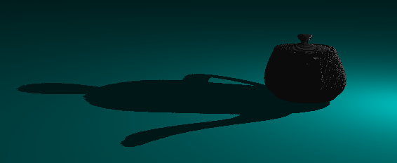

# Shadow
*參考learnOpenGL*

### 使用者手冊

| 按鈕 | 光 效果 |
| ------ | ------ |
| H,N | light move in y-axis direction |
| B,M | light move in x-axis direction |
| G,V | light move in z-axis direction |
| 按鈕 | 攝影機 效果 |
| W,S | camera move in y-axis direction |
| A,D | camera move in x-axis direction |
| R,F | camera move in z-axis direction |
| J.L | camera rotate along y-axis |
| R,F | camera rotate along x-axis |

### 實作
- 可以自行輸入raw檔，並畫出來
相機和燈光的移動速率及初始位址，根據raw檔模型的大小作出相對應的改變

- 模型太大會出現shadow acne的問題，bias太大會導致模型太平滑

### 實作畫面
使用點光源

